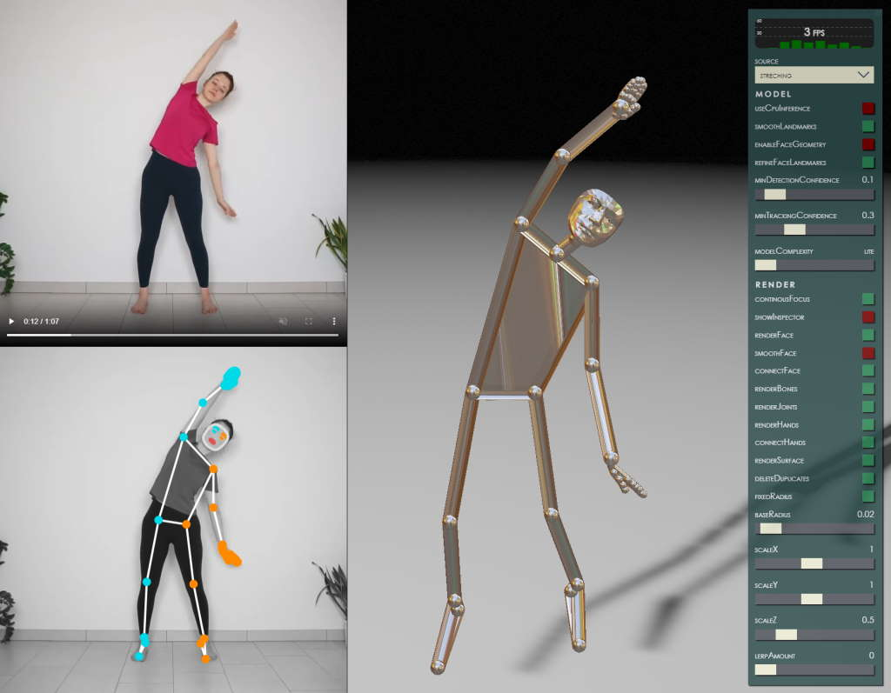

# Holistic

Holistic end-to-end video detection and visualization of **body pose**, **hands with fingers**, and **face mesh**  
Provided as both **2D overlay** and fully reconstructed **3D scene**  

- [**[Live link]**](https://vladmandic.github.io/holistic/public/index.html)

### Screenshot


<br>

## Notes

Running in real-time with **30 FPS** on nVidia RTX3060  
Written in **TypeScript** and transpiled to **JavaScript ECMAScript2020** using `@vladmandic/build` CI tool  
Using:
- `@mediapipe/holistic` for ML detection & analysis: [[Solution]](https://google.github.io/mediapipe/solutions/holistic) | [[Repository]](https://github.com/google/mediapipe)
- `@babylonjs` for 3D rendering [[Docs]](https://doc.babylonjs.com/)
- Custom code for linear interpolation and model reassembly

## Install & Run

Transpiles and bundles solution and starts a dev web server

> npm start

```js
INFO:  User: vlado Platform: linux Arch: x64 Node: v18.10.0
INFO:  Application: { name: '@vladmandic/holistic', version: '0.1.0' }
INFO:  Environment: { profile: 'development', config: '.build.json', package: 'package.json', tsconfig: true, eslintrc: true, git: true }
INFO:  Toolchain: { build: '0.7.14', esbuild: '0.15.12', typescript: '4.8.4', typedoc: '0.23.19', eslint: '8.26.0' }
INFO:  Build: { profile: 'development', steps: [ 'serve', 'watch', 'lint', 'compile' ] }
STATE: WebServer: { ssl: true, port: 8001, root: '', sslKey: 'cert/https.key', sslCrt: 'cert/https.crt' }
STATE: Watch: { locations: [ 'src/**/*' ] }
STATE: Lint: { locations: [ '*.json', 'src/**/*.ts' ], files: 9, errors: 0, warnings: 0 }
STATE: Compile: { name: 'application', format: 'esm', platform: 'browser', input: 'src/index.ts', output: 'dist/index.js', files: 6, inputBytes: 94117, outputBytes: 9976829 }
INFO:  Listening...
DATA:  HTTPS: { method: 'GET', ver: '2.0', status: 200, mime: 'text/html', size: 1761, url: '/', remote: '::1' }
```

> navigate to: <https://localhost:8001>

